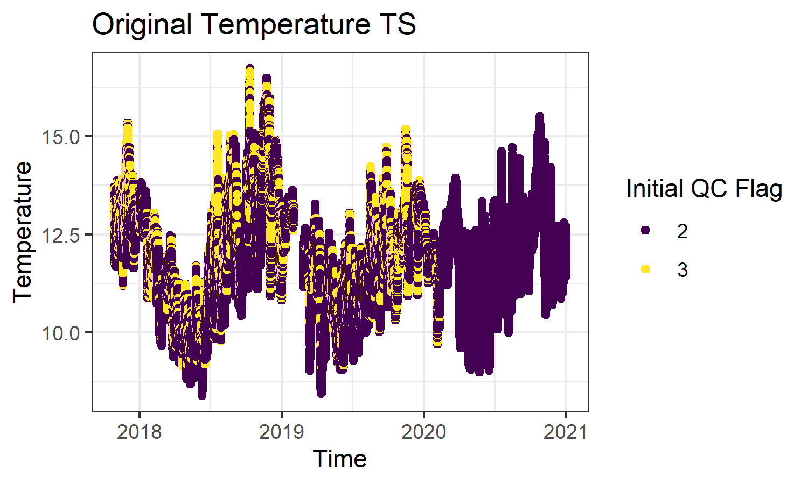
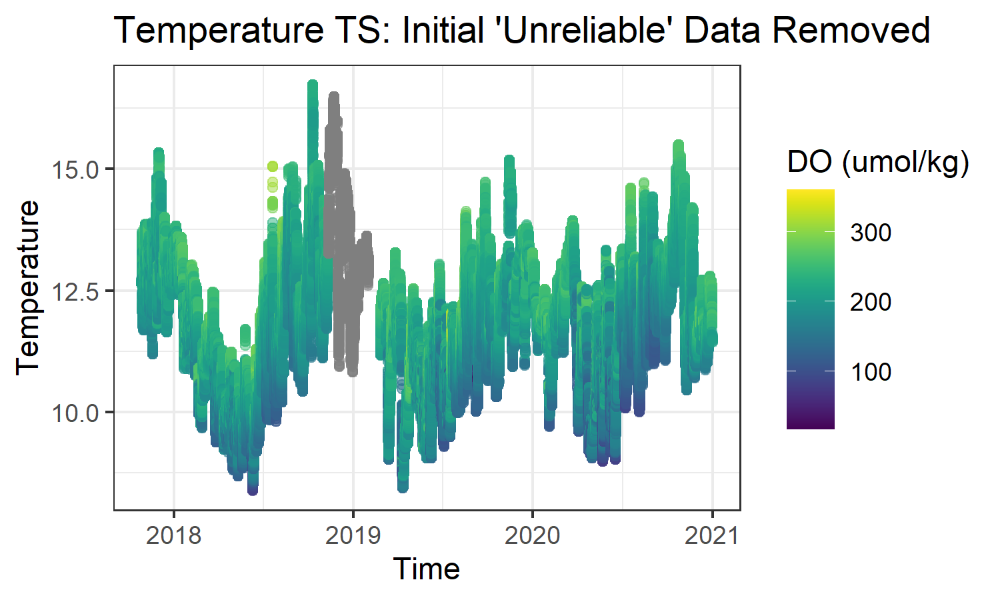
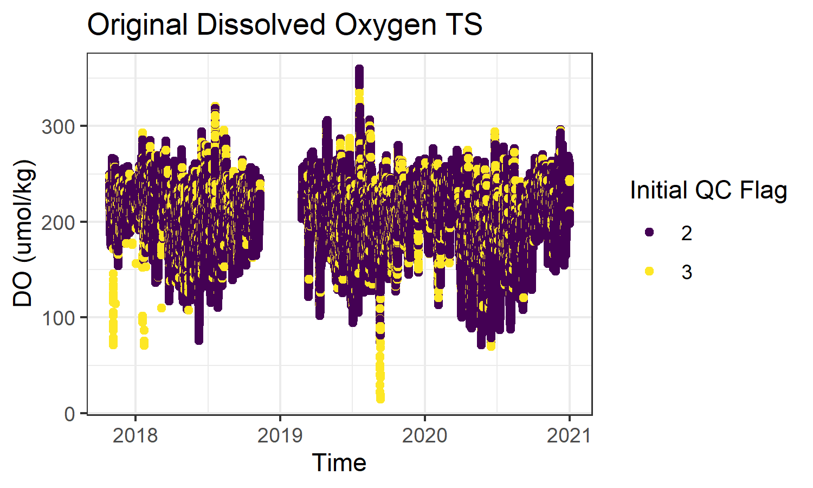
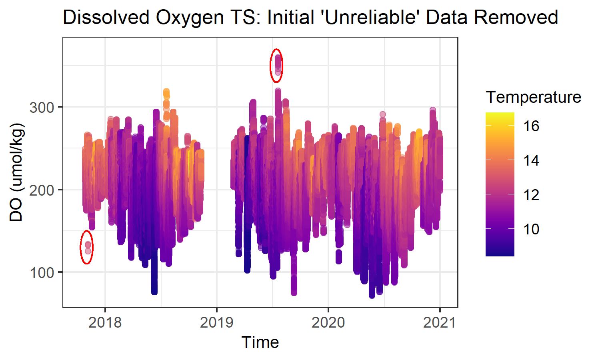
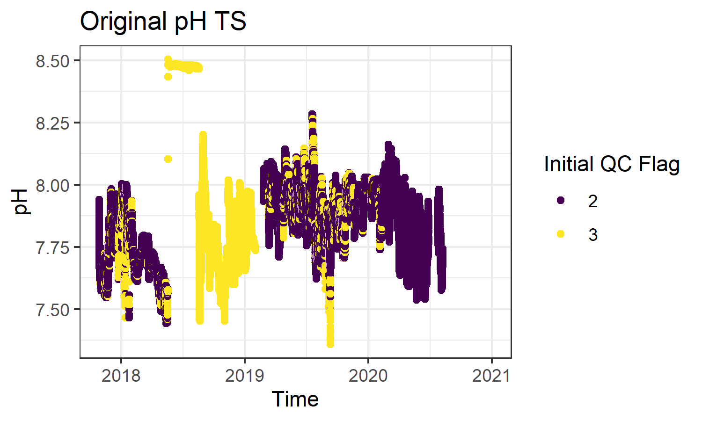
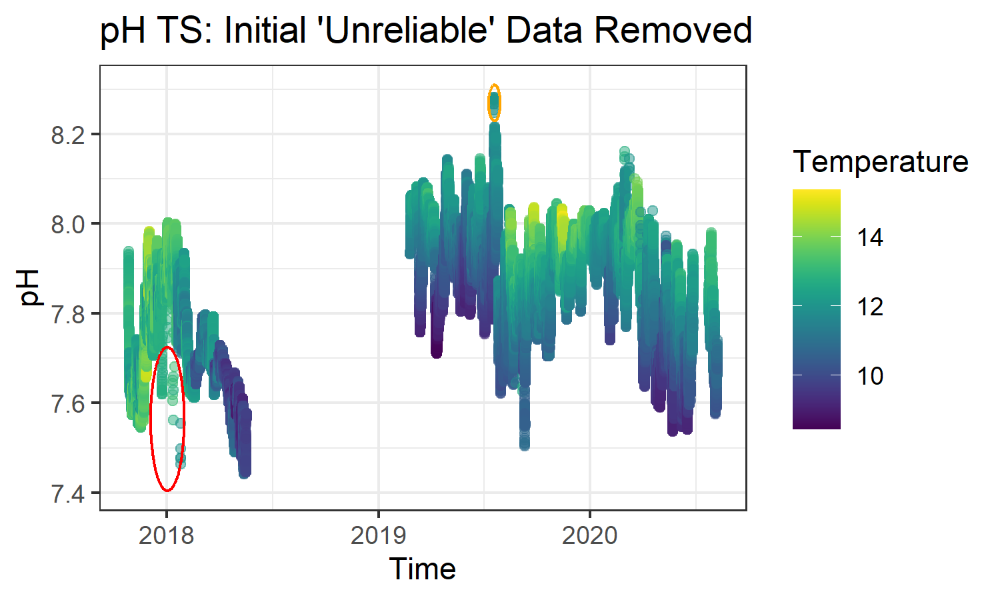
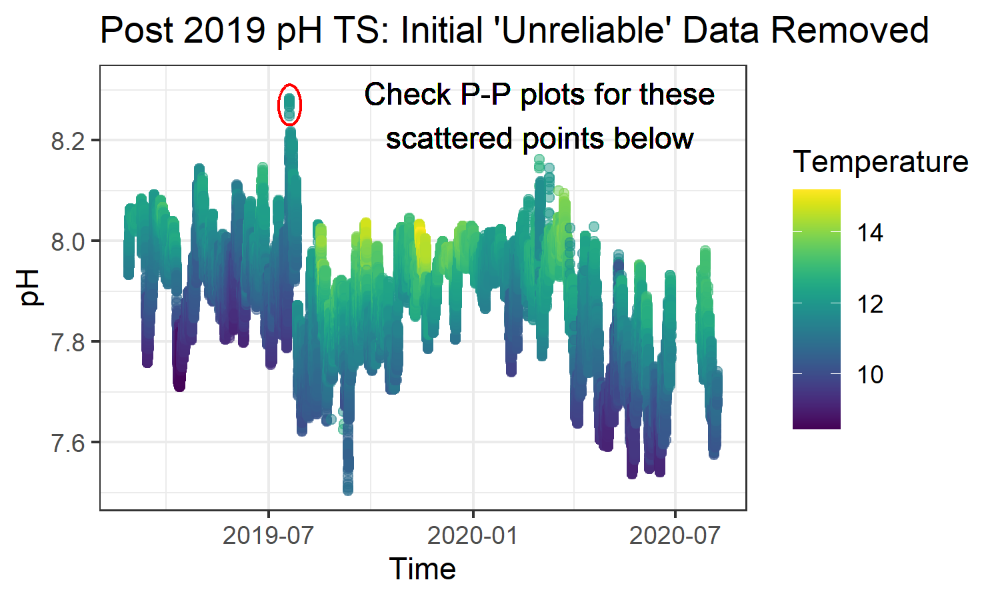
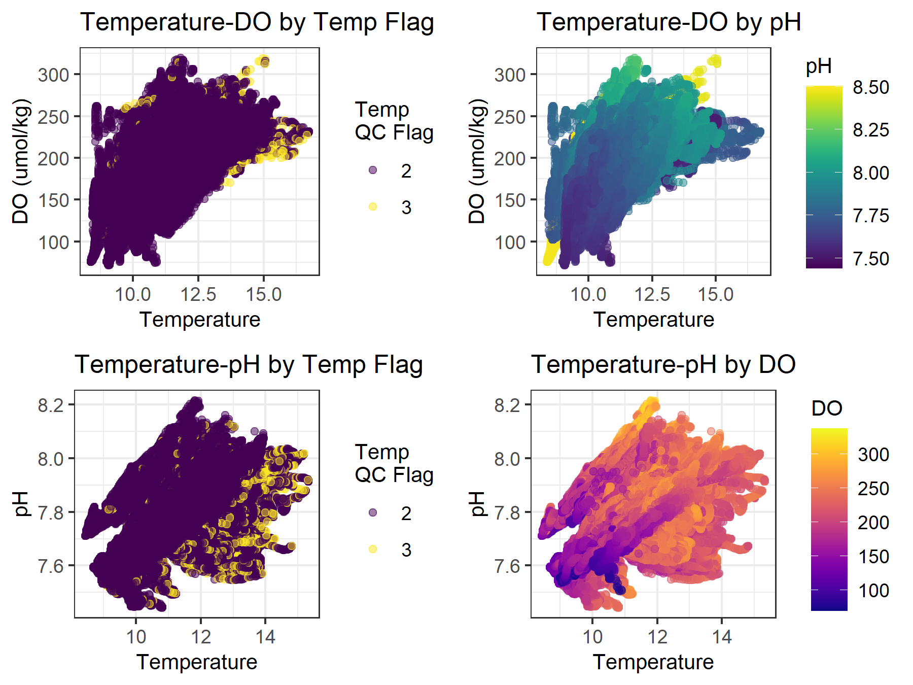
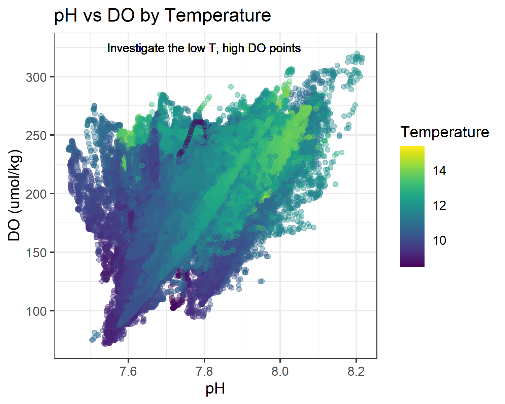
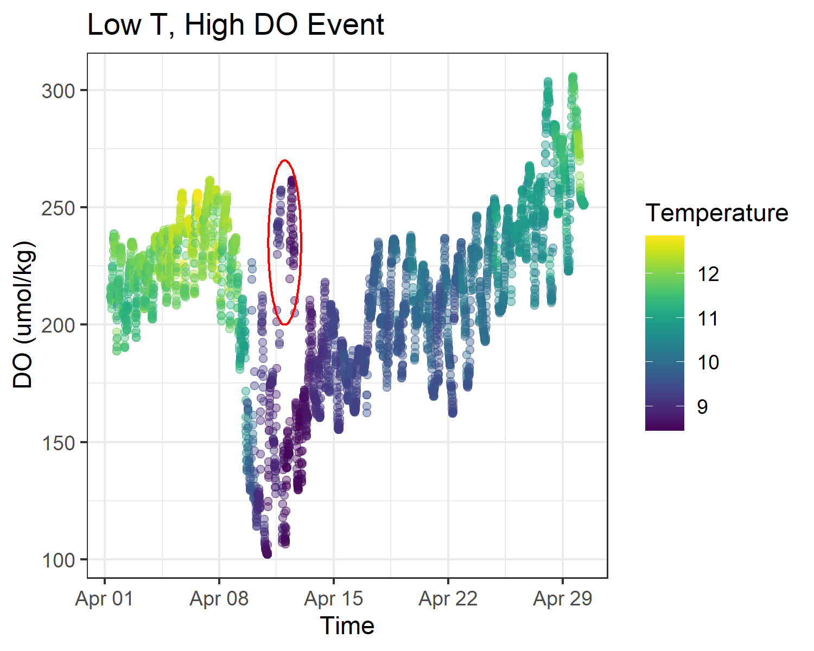

```{r setup, include=FALSE, message = FALSE, warning = FALSE, results = FALSE}
knitr::opts_chunk$set(echo = TRUE, fig.fullwidth = TRUE, fig.height = 3.5, warning = FALSE, message = FALSE)

library("tidyverse")
library("stringr")
library("viridis")
library("cowplot")

theme_set(theme_bw())

```

# Formatting Example
Here, we provide data formatting and quality flagging examples to illustrate our "human in the loop" QA/QC practices. 

We are using a subset of dataset 40 (Kroeker et al., 2023) for both the formatting and flagging example). The full dataset 40 includes temperature, dissolved oxygen, and pH time series from SeapHOx instruments placed at six different sites along the coast. For simplicity, we show only 1/6 sites here. 

All datasets pulled into the MOCHA synthesis were converted to a common format and units. While this process was unique for every dataset, the principles were the following: 
* 1) manipulate the minimal amount necessary. 
* 2) retain all directly measured parameters.
* 3) discard calculated parameters. 

```{r get_data, message = FALSE, results = FALSE, warning = FALSE}
dat <- read_csv("40_subset_BC.csv")
```

```{r circle_fun, include = FALSE}
# Get ready to annotate some graphs
gg_circle <- function(r, days, xc, yc, color="red", fill=NA, ...) {
    xc <- lubridate::date(xc)
    x <- as.POSIXct(xc + days*cos(seq(0, pi, length.out=100)))
    ymax <- yc + r*sin(seq(0, pi, length.out=100))
    ymin <- yc + r*sin(seq(0, -pi, length.out=100))
    annotate("ribbon", x=x, ymin=ymin, ymax=ymax, color=color, fill=fill, ...)
}
```

### Location, date, time, and project information
All observations need to be accompanied by location, date, time, depth, and project information. Here, we assign a dataset ID number to link it to our metadata spreadsheet; add habitat, sampling scheme, and measurement type (gleaned from individual project metadata), and format temporal and spatial columns.

```{r format_project_info, results = FALSE, warning = FALSE, message = FALSE}
## Make our target dataframe with correct formatting
target_cols <- c("dataset_id","latitude","longitude","depth_m","time_utc","t_C",
                 "t_flag","sal_pss","sal_flag","pH_total","pH_flag","pH_type", 
                 "pCO2_uatm", "pCO2_flag","pCO2_type","fCO2_uatm","fCO2_flag",
                 "fCO2_type","tCO2_umolkg","tCO2_flag","tCO2_type","ta_umolkg",
                 "ta_flag","ta_type","do_umolkg","do_sat","do_flag","do_type",
                 "chl_ugL","chl_flag","chl_type","si_umolkg","nh4_umolkg",
                 "no3_umolkg","no2_umolkg","po3_umolkg","nutr_flag","nutr_type", 
                 "habitat", "sample_scheme")
df40 <- data.frame(matrix(nrow = nrow(dat), ncol = 40))
names(df40) <- target_cols


## Input dataset_id, habitat, and sample scheme
## Copy over coordinates, depth, and datetime if possible.
## Input instrument types
df40 <- df40 %>% 
  mutate(dataset_id = 40, sample_scheme = "intertidal/subtidal sensor deployment", 
         habitat = "oceanic") %>% 
  mutate(latitude = dat$latitude, longitude = dat$longitude, 
         depth_m = dat$depth) %>% 
  mutate(pH_type = "autonomous sensor", do_type = "autonomous sensor")

# In this case, the date and time need some formatting before being copied over
#Format the date and time
dat <- dat %>% 
  mutate(day = str_sub(date, start = 1L, end = 2L)) %>% 
  mutate(month = str_sub(date, start = 3L, end = 4L)) %>% 
  mutate(year = str_sub(date, start = 5L, end = 8L)) %>% 
  mutate(date2 = lubridate::make_date(month = month, day = day, 
                                      year = year)) %>% 
  mutate(time_utc = lubridate::ymd_hms(paste(date2, time, sep = " ")))

# Copy the datetime over
df40$time_utc <- dat$time_utc

# Get the temperature when its missing
dat <- dat %>% 
  mutate(qc_temp = ifelse(is.na(temp) & !is.na(do_temp), 2, qc_temp)) %>% 
  mutate(temp = ifelse(is.na(temp), do_temp, temp))

```

Measured parameter data should be accompanied by QA/QC information when possible. Whatever the original publisher's QA/QC system, we mapped all data highlighted by the original investigators as "bad" or "unreliable" to our flag of 3. All other data, regardless of author notes, was mapped to our flag of 2 (unevaluated) until the secondary QC stage demonstrated in part 2 of this supplement. In this example dataset, the columns "qc_temp", "do_qc", and "qc_pH" are the quality control notes from primary QC. A "4" flag denotes unreliable observations.

```{r grab_params, results = FALSE, warning = FALSE, message = FALSE}
# Grab temperature, do (umol/kg), and pH observations and quality flags
# Map "bad" flags to 3, all others to 2
df40 <- df40 %>% 
  mutate(t_C = dat$temp, pH_total = dat$pH, do_umolkg = dat$do_umolkg) %>% 
  mutate(t_flag = dat$qc_temp, pH_flag = dat$qc_pH, do_flag = dat$do_qc) %>% 
  mutate(across(c(t_flag, pH_flag, do_flag), ~ ifelse(. == 4, 3, 2)))
```

When necessary, measured parameters were converted to our chosen units or adjusted for *in-situ* conditions. In this example dataset, the temperature is already in degrees Celcius and the pH is already *in-situ* and on the total scale, but the dissolved oxygen needs to be converted to saturation.

```{r do_conversion, results = FALSE, warning = FALSE, message = FALSE}
oxy_saturation <- function(temperature_celsius, do_umolkg, salinity){
  
  A0 = 5.80818
  A1 = 3.20684
  A2 = 4.11890
  A3 = 4.93845
  A4 = 1.01567
  A5 = 1.41575
  B0 = -7.01211e-3
  B1 = -7.25958e-3
  B2 = -7.93334e-3
  B3 = -5.54491e-3
  C0 = -1.32412e-7
  
  Temp = log((298.15-temperature_celsius)/(273.15+temperature_celsius))
  
  #Get the saturation percent
  100 * do_umolkg/exp((A0 + A1*Temp + A2*Temp^2 + A3*Temp^3 + A4*Temp^4 + 
                         A5*Temp^5) + salinity*(B0 + B1*Temp + B2*Temp^2 + 
                                                  B3*Temp^3) + C0*salinity^2)
}


# Convert the DO to %sat using a salinity of 33.5, as recommended by the Kroeker lab
df40 <- df40 %>% 
  mutate(do_sat = oxy_saturation(t_C, do_umolkg, 33.5))

```

The dataset is now formatted and ready for our secondary QC practices.

# QA/QC Example: Dataset 40 Subset
For all dataset in this compilation, our flagging principles were the following: 
* All data identified as unreliable by the original publishers/investigators is assigned an "unreliable" (3) flag.
  + Retain these flags even if the data looks reasonable during this secondary QC.
* All other data is examined through as many lenses as possible and considered in its geographic and temporal context.
* Err toward inclusion. If data are reasonable and plausible, do not assign an "unreliable" flag.
* For all data that have been examined, upgrade quality flags from 2s (unexamined) to 1s (plausible and reliable) after identifying all unreliable data.

## Dataset 40 Considerations
This example will walk through our typical project QA/QC procedures for time series data using a subset of dataset 40 from the Big Creek site and formatted in the example above. These data were generated by a submerged SeapHOx measuring *in-situ* temperature, dissolved oxygen, and pH and are published in full in Kroeker et al. (2023).

For autonomous sensor datasets, QA/QC starts with time series graphs, then moves into property-property plots as appropriate. Here, we show the original time series plots with the original investigator's initial quality flags. Next, we will identify any additional data that should be assigned an "unreliable" (3) quality flag.

For each of the time series below, we first show all of the data with "unreliable" observations identified by primary QC colored in yellow. Next, we filter out this unreliable data to focus on the data that needs secondary QC. These plots are colored by a second parameter to provide additional context. Additional data identified as "unreliable" during the secondary QC using the time series is circled in red.
\newpage

## Individual Time Series QA/QC

### Temperature Time Series
The temperature time series looks plausible. Additional unreliable temperatures may become apparent in property-property plots (next section).

```{r temp_flagging, echo = FALSE, cache = TRUE, eval = FALSE}
fig <- df40 %>% 
  mutate(t_flag = factor(t_flag)) %>% 
  ggplot()+
  geom_point(aes(x = time_utc, y = t_C, color = t_flag))+
  labs(x = "Time", y = "Temperature", color = "Initial QC Flag", 
       title = "Original Temperature TS")+
  scale_color_viridis_d()
png(filename = "supplement_images/T_flag_TS_fig1.png", height = 3, width = 5, units = "in", res = 300)
print(fig)
dev.off()


fig <- df40 %>% 
  mutate(t_flag = factor(t_flag)) %>% 
  filter(t_flag != 3) %>% 
  ggplot()+
  geom_point(aes(x = time_utc, y = t_C, color = do_umolkg), alpha = 0.5)+
  labs(x = "Time", y = "Temperature", color = "DO (umol/kg)", 
       title = "Temperature TS: Initial 'Unreliable' Data Removed")+
  scale_color_viridis()
png(filename = "supplement_images/T_flag_TS_fig2.png", height = 3, width = 5, units = "in", res = 300)
print(fig)
dev.off()
```
\

\
\newpage

### Dissolved Oxygen Time Series

```{r do_TS, echo = FALSE, cache = TRUE, eval = FALSE}
fig <- df40 %>% 
  filter(!is.na(do_flag)) %>% 
  mutate(do_flag = factor(do_flag)) %>% 
  ggplot()+
  geom_point(aes(x = time_utc, y = do_umolkg, color = do_flag))+
  labs(x = "Time", y = "DO (umol/kg)", color = "Initial QC Flag", 
       title = "Original Dissolved Oxygen TS")+
  scale_color_viridis_d()
png(filename = "supplement_images/DO_flag_TS_fig1.png", height = 3, width = 5, units = "in", res = 300)
print(fig)
dev.off()

fig <- df40 %>% 
  mutate(do_flag = factor(do_flag)) %>% 
  filter(do_flag != 3) %>% 
  ggplot()+
  geom_point(aes(x = time_utc, y = do_umolkg, color = t_C), alpha = 0.5)+
  gg_circle(r = 20, days = 20, xc = "2017-11-01", yc = 130)+
  gg_circle(r = 20, days = 20, xc = "2019-07-15", yc = 350)+
  labs(x = "Time", y = "DO (umol/kg)", color = "Temperature", title = "Dissolved Oxygen TS: Initial 'Unreliable' Data Removed")+
  scale_color_viridis(option = "plasma")+
  theme(title = element_text(size = 10))
png(filename = "supplement_images/DO_flag_TS_fig2.png", height = 3, width = 5, units = "in", res = 300)
print(fig)
dev.off()

```
\

\
\newpage

### pH Time Series

```{r pH_TS, echo = FALSE, cache = TRUE, eval = FALSE}
fig <- df40 %>% 
  mutate(pH_flag = factor(pH_flag)) %>% 
  ggplot()+
  geom_point(aes(x = time_utc, y = pH_total, color = pH_flag))+
  labs(x = "Time", y = "pH", color = "Initial QC Flag", title = "Original pH TS")+
  scale_color_viridis_d()
png(filename = "supplement_images/pH_flag_TS_fig1.png", height = 3, width = 5, units = "in", res = 300)
print(fig)
dev.off()

fig <- df40 %>% 
  mutate(pH_flag = factor(pH_flag)) %>% 
  filter(pH_flag != 3) %>% 
  ggplot()+
  geom_point(aes(x = time_utc, y = pH_total, color = t_C), alpha = 0.5)+
  gg_circle(r = 0.16, days = 29, xc = "2018-01-02", yc = 7.565)+
  gg_circle(r = 0.04, days = 10, xc = "2019-07-20", yc = 8.27, color = "orange")+
  labs(x = "Time", y = "pH", color = "Temperature", 
       title = "pH TS: Initial 'Unreliable' Data Removed")+
  scale_color_viridis()
png(filename = "supplement_images/pH_flag_TS_fig2.png", height = 3, width = 5, units = "in", res = 300)
print(fig)
dev.off()
```
\

\

As necessary, we examined subsets of time series to get a closer look at the data. Here, we're showing the previous time series from 2019 onward. This highlights a few scattered pH observations in 2020 that seem to have unusual temperatures relative to surrounding data and might be unreliable, though they do not have extreme pH values. These points will be better investigated in property-property plots.

```{r pH_TS_cont, echo = FALSE, eval = FALSE}
fig <- df40 %>% 
  filter(time_utc > "2019-01-01") %>% 
  mutate(pH_flag = factor(pH_flag)) %>% 
  filter(pH_flag != 3) %>% 
  ggplot()+
  geom_point(aes(x = time_utc, y = pH_total, color = t_C), alpha = 0.5)+
  gg_circle(r = 0.04, days = 10, xc = "2019-07-20", yc = 8.27)+
  geom_text(aes(x = ymd_hms("2020-03-01 12:00:00 UTC"), y = 8.25), 
            label = "Check P-P plots for these\nscattered points below")+
  labs(x = "Time", y = "pH", color = "Temperature", title = "Post 2019 pH TS: Initial 'Unreliable' Data Removed")+
  scale_color_viridis()
png(filename = "supplement_images/pH_flag_TS_fig3.png", height = 3, width = 5, units = "in", res = 300)
print(fig)
dev.off()

```
\

### Apply the additional time series flags
Flag the additional unreliable data identified in the time series plots. Retain the 3 flags for all previously identified unreliable data. Eliminate flags for rows with no data.

Note that this flagging code is based on the specific plots and data shown. Each dataset was examined individually, generic flags based on time or parameter values do not apply across datasets (e.g., the code identifying the 2017 unreliable dissolved oxygen observations is not meant to imply that *all* dissolved oxygen observations before 2018 and below 150 umol/kg are considered unreliable).

```{r apply_ts_flags, message = FALSE, results = FALSE, warning = FALSE}
df40 <- df40 %>% 
  mutate(t_flag = case_when(t_flag == 3 ~ 3,
                            !is.na(t_C) ~ 2,
                            TRUE ~ NA_real_)) %>% 
  mutate(do_flag = case_when(do_flag == 3 ~ 3,
                             time_utc < "2018-01-01" & do_umolkg < 150 ~ 3,
                             do_umolkg > 330 ~ 3,
                             !is.na(do_umolkg) ~ 2,
                             TRUE ~ NA_real_)) %>% 
  mutate(pH_flag = case_when(pH_flag == 3 ~ 3,
                             time_utc > "2017-12-20" & time_utc < "2017-12-25" 
                             & pH_total < 7.79 ~ 3,
                             time_utc > "2018-01-01" & time_utc < "2018-01-15" 
                             & pH_total < 7.81 ~ 3,
                             time_utc > "2018-01-15" & time_utc < "2018-02-15" 
                             & pH_total < 7.6 ~ 3,
                             pH_total > 8.24 ~ 3,
                             !is.na(pH_total) ~ 2,
                             TRUE ~ NA_real_))
```

## Property-Property QA/QC for Autonomous Sensor Data
With all multiparameter data sets, we used property-property plots to ensure that data relationships were consistent with biological activity, conservative mixing, and other oceanographic considerations. Here, we will focus on dissolved oxygen and pH data that have not been identified as unreliable either in the original author's quality control or in our time series-based secondary quality control discussed above. All pH and DO data that has already been flagged with a 3 QC value has been excluded. "Unreliable" temperature data is retained in these plots to examine how these temperatures might have affected the pH and DO measurements.

### Property-Property Plots for Dataset 40 Subset

```{r t_do_ppplot, echo = FALSE, cache = TRUE, fig.height = 6, eval = FALSE}
fig1 <- df40 %>% 
  mutate(t_flag = factor(t_flag)) %>% 
  filter(do_flag != 3 & !is.na(do_umolkg)) %>% 
  ggplot()+
  geom_point(aes(x = t_C, y = do_umolkg, color = t_flag), alpha = 0.5)+
  scale_color_viridis_d()+
  labs(x = "Temperature", y = "DO (umol/kg)", title = "Temperature-DO by Temp Flag", color = "Temp\nQC Flag")+
  theme(title = element_text(size = 10))

fig2 <- df40 %>% 
  filter(!is.na(t_C) & !is.na(do_umolkg) & !is.na(pH_total)) %>% 
  filter(do_flag != 3 & !is.na(do_umolkg)) %>% 
  ggplot()+
  geom_point(aes(x = t_C, y = do_umolkg, color = pH_total), alpha = 0.5)+
  scale_color_viridis()+
  labs(x = "Temperature", y = "DO (umol/kg)", title = "Temperature-DO by pH", color = "pH")+
  theme(title = element_text(size = 10))

fig3 <- df40 %>% 
  mutate(t_flag = factor(t_flag)) %>% 
  filter(pH_flag != 3 & !is.na(pH_total)) %>% 
  ggplot()+
  geom_point(aes(x = t_C, y = pH_total, color = t_flag), alpha = 0.5)+
  scale_color_viridis_d()+
  labs(x = "Temperature", y = "pH", title = "Temperature-pH by Temp Flag", color = "Temp\nQC Flag")+
  theme(title = element_text(size = 10))

fig4 <- df40 %>% 
  filter(!is.na(t_C) & !is.na(do_umolkg) & !is.na(pH_total)) %>% 
  filter(pH_flag != 3 & !is.na(pH_total)) %>% 
  ggplot()+
  geom_point(aes(x = t_C, y = pH_total, color = do_umolkg), alpha = 0.5)+
  scale_color_viridis(option = "plasma")+
  labs(x = "Temperature", y = "pH", title = "Temperature-pH by DO", color = "DO")+
  theme(title = element_text(size = 10))

fig <- plot_grid(fig1, fig2, fig3, fig4, nrow = 2, ncol = 2)
png(filename = "supplement_images/property_property_plot_grid.png", height = 4.5, width = 6, units = "in", res = 300)
print(fig)
dev.off()
```
\

\

\
```{r do_pH, echo = FALSE, eval = FALSE}
fig <- df40 %>% 
  filter(pH_flag != 3 & do_flag != 3) %>% 
  ggplot()+
  geom_point(aes(x = pH_total, y = do_umolkg, color = t_C), alpha = 0.4)+
  geom_text(aes(x = 7.8, y = 325), label = "Investigate the low T, high DO points", size = 3)+
  scale_color_viridis()+
  labs(x = "pH", y = "DO (umol/kg)", title = "pH vs DO by Temperature", color = "Temperature")
png(filename = "supplement_images/property_property_pH_vs_DO.png", height = 4, width = 5, units = "in", res = 300)
print(fig)
dev.off()

fig <- df40 %>% 
  filter(do_flag != 3 & time_utc > "2019-04-01" & time_utc < "2019-04-30") %>% 
  ggplot()+
  geom_point(aes(x = time_utc, y = do_umolkg, color = t_C), alpha = 0.4)+
  gg_circle(r = 35, days = 1, xc = "2019-04-12", yc = 235)+
  scale_color_viridis()+
  labs(x = "Time", y = "DO (umol/kg)", title = "Low T, High DO Event", color = "Temperature")
png(filename = "supplement_images/DO_TS_event_subset.png", height = 4, width = 5, units = "in", res = 300)
print(fig)
dev.off()

```

The property-property plots look plausible in general and don't suggest many additional flags. We will flag the high dissolved oxygen readings associated with the very low temperature event in April of 2019 since these readings are far above what any similar temperature dissolved oxygen values are *and* the sensor data has a large discontinuity between the bulk of the dissolved oxygen readings and the anomalous, higher dissolved oxygen readings.

After marking these high dissolved oxygen readings, we will update all data that hasn't been flagged with a "unreliable" marker (3) to a "reliable or plausible" (1) QC status.

```{r finish_df40, message = FALSE, results = FALSE, warning = FALSE}
## Apply 3 flags to the high DOs in mid April 2019
## Update all flags that aren't 3s to be 1s
df40 <- df40 %>% 
  mutate(do_flag = case_when(do_flag == 3 ~ 3,
                             do_umolkg > 225 & t_C < 9 & time_utc > "2019-04-08" 
                              & time_utc < "2019-04-15" ~ 3,
                             do_umolkg > 200 & t_C < 9 & time_utc > "2019-04-12" 
                               & time_utc < "2019-04-13" ~ 3,
                             !is.na(do_umolkg) ~ 1,
                             TRUE ~ NA_real_)) %>% 
  mutate(pH_flag = case_when(pH_flag == 3 ~ 3,
                             !is.na(pH_total) ~ 1,
                             TRUE ~ NA_real_)) %>% 
  mutate(t_C = case_when(t_flag == 3 ~ 3,
                         !is.na(t_C) ~ 1,
                         TRUE ~ NA_real_))

```

## References
Kroeker, K. J., Donham, E. M., Vylet, K., Warren, J. K., Cheresh, J., Fiechter, J., Freiwald, J., and Takeshita, Y.: Exposure to extremes in multiple global change drivers: Characterizing pH , dissolved oxygen, and temperature variability in a dynamic, upwelling dominated ecosystem, Limnol. Oceanogr., 1–13, https://doi.org/10.1002/lno.12371, 2023.


